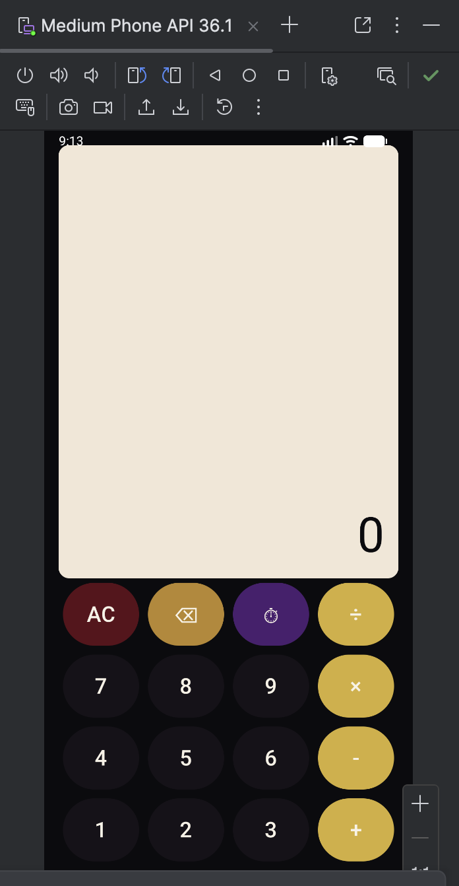

# Compose Calculator (CMSC 495)

A modern calculator application for Android built using Kotlin and Jetpack Compose.  
This project was developed as part of the CMSC 495 Computer Science Capstone and focuses on UI design, state management, and collaborative software development using GitHub.

Rather than aiming for feature overload, this calculator emphasizes clarity, polish, and a maintainable structure—both in code and in design.

## Screenshot


## Features
- Basic arithmetic operations: addition, subtraction, multiplication, and division  
- Decimal input with clean, formatted output  
- Toggleable calculation history panel  
- Custom dark UI theme using gold, plum, and ink tones  
- Fully Compose-based layout using Material 3  
- Clearly commented code to support team collaboration  

## Core Controls

| Button | Function |
|------:|----------|
| AC | Clears all input and resets the calculator |
| ⌫ | Removes the last entered character |
| ⏱ | Shows or hides calculation history |
| = | Evaluates the current expression |

## UI Design Approach
The calculator uses a centralized color palette to keep the interface cohesive and easy to adjust as the project evolves.

- Deep ink tones create a calm, low-contrast background  
- A parchment-style display improves readability and visual balance  
- Gold operator buttons guide attention toward primary actions  
- Plum accents add character without distracting from usability  

All colors are defined in a single palette object, allowing the visual theme to evolve without impacting layout or calculation logic.

## Built With
- Kotlin  
- Jetpack Compose  
- Material 3  
- Android Studio  

State is handled directly in Compose using thoughtful `remember` and `mutableStateOf` usage, keeping the logic readable and appropriate for the scope of the project.

## Capstone Focus and Learning Outcomes
This project was designed to reflect the goals of a capstone course by prioritizing:

- Readable, maintainable code over unnecessary complexity  
- Intentional UI design rather than default styling  
- Team-based development practices, including branching, pull requests, and code review  
- Clear documentation that explains both *what* the app does and *why* design decisions were made  

Through this project, the team gained hands-on experience with Jetpack Compose, shared codebases, merge conflict resolution, and collaborative UI decision-making.

## Getting Started

### Prerequisites
- Android Studio Iguana (2023.2.1) or newer  
- Android emulator or physical Android device  

### Installation
1. Clone the repository:
   ```sh
   git clone https://github.com/jsadegh/AndroidCalculatorCMSC495.git
Open the project in Android Studio

Allow Gradle to sync and install dependencies

Run the app on an emulator or connected device

Usage
Use number and operator buttons to build an expression

Press = to calculate the result

Use ⌫ to delete the last character

Tap ⏱ to view calculation history

Press AC to reset the calculator

Results are automatically formatted for clarity, displaying whole numbers cleanly and trimming unnecessary decimal zeros.

Collaboration and Git Workflow
This project was developed collaboratively using GitHub.

Features and UI changes were developed on separate branches

Pull requests were used to merge changes cleanly

Descriptions clearly outlined what was modified and what remained unchanged

This workflow mirrors common professional development practices and helped maintain a stable main branch throughout development.

Contributing
Suggestions and improvements are welcome.

To contribute:

Fork the repository

Create a feature branch:

sh
Copy code
git checkout -b feature/YourFeatureName
Commit your changes

Push to your branch

Open a pull request

License
Distributed under the MIT License.
See the LICENSE file for more information.
